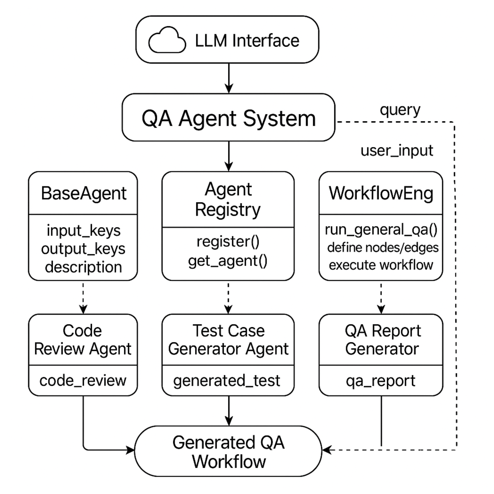

# QA Agent Framework




A modular framework for automating Software QA using LLM-based agents.  
(Supports code review, bug detection, test generation, refactoring, and more)

🇰🇷 [View in Korean](./docs/README_kor_.md)


LLM 기반 에이전트를 활용하여 Software QA를 지원하는 모듈형 프레임워크입니다.  
(코드 리뷰, 버그 탐지, 테스트 생성, 리팩토링 등 다양한 QA 작업 지원)

## ✨ Features

- Built-in expert QA agents for common code analysis tasks  
- Multi-step workflow execution with LangGraph  
- Natural language → multi-agent orchestration (Auto QA)  
- SDK for defining and registering your own agents  
- Unified and structured output in JSON  


## 🚀 Installation

```bash
pip install qa-agent-lib
```

## 🔧 Available SDK Functions
You can easily access all core features via:


```python
from qa_agent import (
    run_auto_qa,
    run_workflow_qa,
    run_single_qa,
    create_prompt_agent,
    save_agent,
    load_agent,
    register_agent,
    get_agent,
)
``` 

## Quick Examples

### ✅ 1. Run a Auto Multi-Agent ⭐️

> Automatically selects the best agents based on your natural language request.

```python
from qa_agent import run_auto_qa

result = run_auto_qa(
    query="Review this function and write test cases.",
    input="def add(a, b): return a + b",
    model="chatgpt",
    model_type="gpt-3.5-turbo"
)
print(result["qa_report"])
```

### ✅ 2. Run a single QA agent

> Directly run a specific agent such as code review or bug detection.

```python
from qa_agent import run_single_qa

result = run_single_qa(
    input="def subtract(a, b): return a - b",
    agent_name="code_review",
    model="chatgpt",
    model_type="gpt-3.5-turbo"
)
print(result["code_review"])
```

### ✅ 3. Run a predefined workflow for Multi-Agent ⭐️

> You can define a QA pipeline using LangGraph + YAML.
Each node represents an agent, and edges define execution order.


```yaml
nodes:
  - name: code_review
    agent: code_review
  - name: test_gen
    agent: test_case_generator
  - name: reporter
    agent: qa_report_generator

edges:
  - source: code_review
    target: test_gen
  - source: test_gen
    target: reporter
```

Run the YAML workflow:

```python
from qa_agent import run_workflow_qa

result = run_workflow_qa(
    input="def divide(a, b): return a / b",
    model="chatgpt",
    model_type="gpt-3.5-turbo",
    yaml_path="workflows/review_and_test.yaml"
)
print(result)
```

### ✅ 4. Create your own QA agent

> Quickly define and register your own agent using a prompt template.

```python
from qa_agent import create_prompt_agent

create_prompt_agent(
    name="security_checker",
    description="Check code for security issues.",
    input_keys=["code"],
    output_key="security_risks",
    prompt_template="""
You are a security expert.
Analyze the following code and list any vulnerabilities in JSON format.

Code:
{code}
"""
)
```

### ✅ 5. Agent Utils

> You can save, load, register, and view available agents.

```python
from qa_agent import save_agent, load_agent

# Save to disk
save_agent("security_checker", path="saved/security_checker.json")

# Load it later
load_agent(path="saved/security_checker.json")

# Resgister Agent
register_agent("Code_reviwer", CodeReviewer())

# Get stored Agent
get_agent() # ['Code_reviwer', 'bug_detect', 'test_case_gent' ...]
```


## 🧪 Built-in QA Agents

> We provide several built-in QA agents out of the box.
You can retrieve all available agents via get_agent().

| Agent Name             | Description                                       | Output Key            |
|------------------------|---------------------------------------------------|------------------------|
| `code_review`          | Review code for bugs, structure, and readability  | `code_review`          |
| `bug_detection`        | Detect exceptions, edge cases, or logic bugs      | `bugs_found`           |
| `test_case_generator`  | Generate unit test cases                          | `generated_test`       |
| `refactor_suggester`   | Suggest performance and readability improvements  | `refactor_suggestion`  |
| `complexity_analyzer`  | Analyze cyclomatic complexity & structure         | `complexity_feedback`  |
| `docstring_generator`  | Generate docstrings for functions and classes     | `docstring`            |
| `qa_report_generator`  | Summarize all outputs into a final markdown report| `qa_report`            |


**Feedback is always welcome!**

**피드백은 언제든 환영입니다! 🙌**

